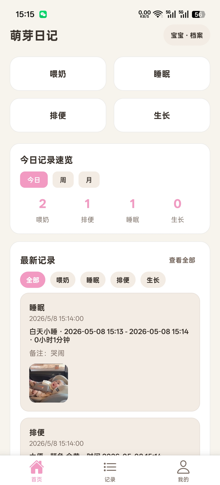
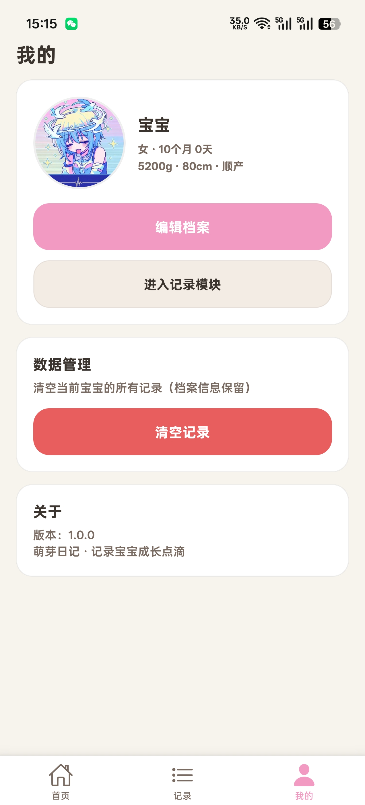
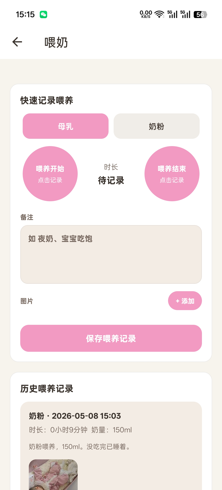
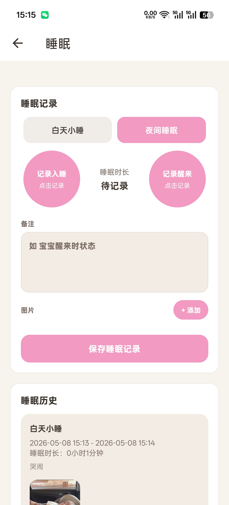
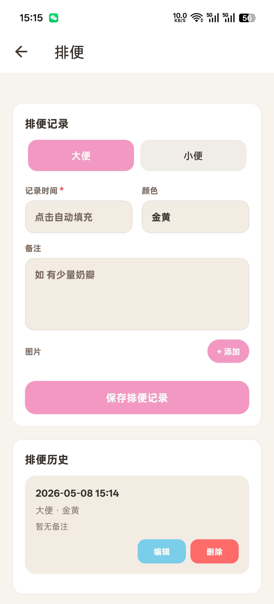
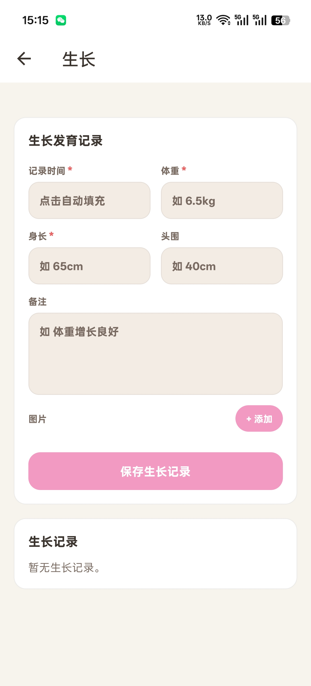
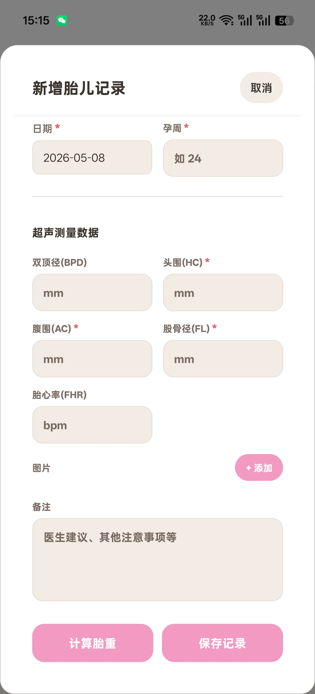

<!--idoc:ignore:start-->
> [!TIP]
> Declaration: This project is not an open-source project. The repository serves as the official website, used to collect issues and user demands. This is done to save costs, because without an official website, the application cannot pass the review.
<!--idoc:ignore:end-->

   
   
  
  <h1>
    Sprout Diary
  </h1>
  <!--rehype:style=border: 0;-->
  

    
    
    
  

  

    <a href="./README.zh.md">简体中文</a> • 
    <a target="_blank" href="https://github.com/hy916/GerminationDiary/issues/new?template=bug_report.yml">Contact & Support</a> • 
    <a href="./CHANGELOG.md">Changelog</a>
  

Sprout Diary is a parenting app designed for families with babies aged 0-3. It helps parents and caregivers record feeding, diaper logs, sleep, body status, and growth development in a structured timeline. The app focuses on reducing fragmented notes and making daily childcare records easier to track, review, and export when needed.

## Features

- **Baby Profiles:** Create and manage multiple baby profiles for multi-child families.
- **Feeding Records:** Log breastfeeding, formula, solids, water intake, intervals, and night feeds.
- **Daily Logs:** Record diaper activity, sleep sessions, crying, and routine care events.
- **Health Tracking:** Track temperature, skin issues, and daily health conditions with notes.
- **Growth Timeline:** Record weight, length/height, head circumference, and milestones over time.
- **Reminders:** Set reminders for vaccines, checkups, growth entries, and daily care tasks.
- **Data Management:** Support backup, export, and record management for long-term retention.
